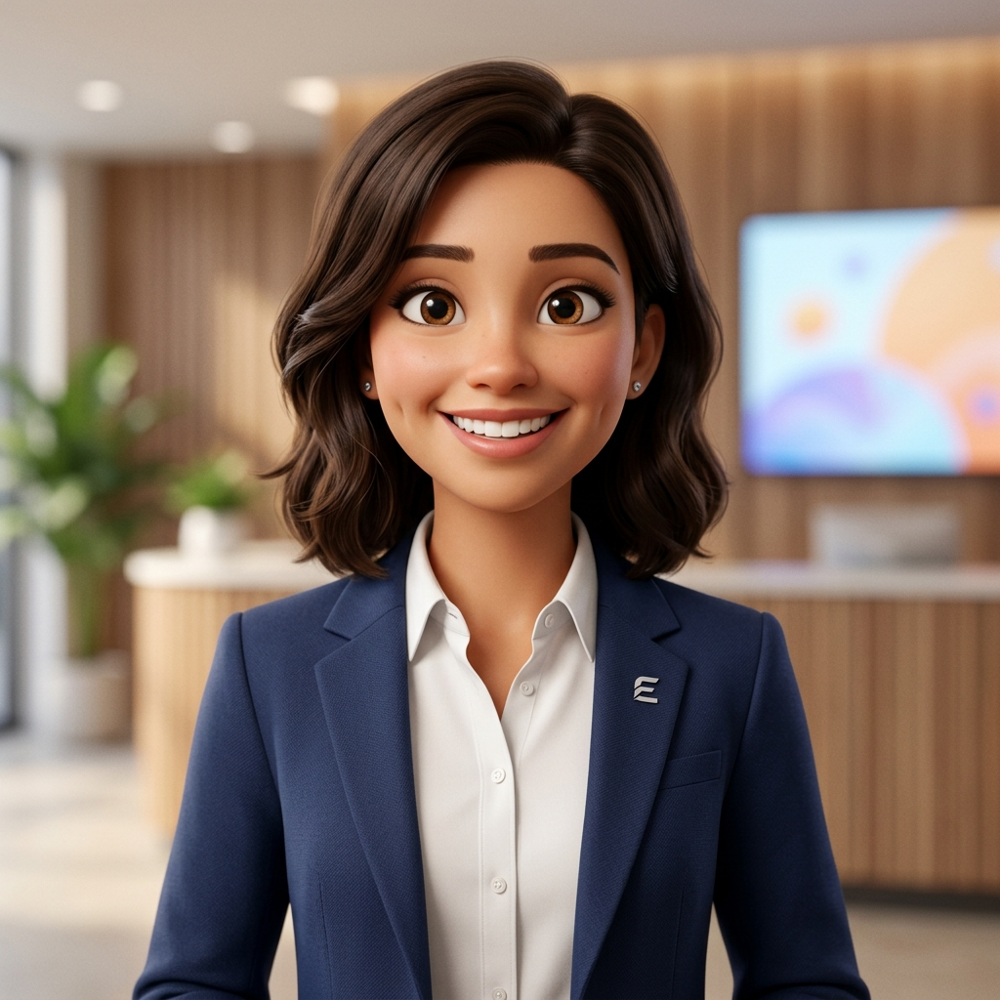

# AI Interview Coach for Freshers and Students

A real-time multimodal computer vision and speech evaluation platform designed to help students and job seekers master non-verbal communication and spoken interview presence.



---

## 🌟 Key Features

### 1. Computer Vision Non-Verbal Analysis
- **Posture Tracking (MediaPipe Pose)**:
  - Continuously evaluates upright posture, slouching, forward head posture, body leaning (left/right), and uneven shoulders.
  - Computes shoulder angle, spine angle, head-to-neck drop ratio, and posture stability index (0–100%).
- **Facial Behavior Engine (MediaPipe Face Mesh)**:
  - Measures normalized facial ratios (mouth width / face width, mouth opening / face height, mouth corner elevation).
  - Detects measurable states: *Neutral facial expression*, *Slight smile*, *Smile detected*, *Strong smile*, *Frequent mouth opening*, *Reduced facial movement*.
  - Reports **Facial Engagement Score** (0–100%).
- **Visual Attention & Head Pose (MediaPipe Face Mesh)**:
  - Tracks 3D head yaw (turn left/right), pitch, and roll (head tilt).
  - Reports **Visual Attention %** and status (*FACING CAMERA*, *LOOKING AWAY FREQUENTLY*).
- **Hand Gesture Dynamics (MediaPipe Hands)**:
  - Analyzes 3D finger extension and joint angles to detect gestures (*Open palm*, *Fist*, *Pointing*, *Peace*, *Thumbs up*, *Neutral*).
  - Evaluates movement velocity (*Minimal*, *Natural*, *Excessive*). Natural communicative gestures are encouraged and NOT penalized.

### 2. Temporal Smoothing & Stability
- Uses a **15-frame circular buffer**, moving average, and hysteresis state voting.
- Eliminates single-frame noise and prevents UI flickering.

### 3. Speech & Basic NLP Analysis
- **Web Speech API (STT)**: Real-time speech-to-text transcription.
- **Speaking Speed (WPM)**: Tracks pace and speech cadence.
- **Filler Word Detection**: Identifies filler words (`um`, `uh`, `like`, `actually`, `basically`, `you know`).
- **Basic NLP Language Analysis**: Rule-based detection of common preposition and grammar patterns with rephrasing suggestions.

### 4. Transparent Scoring System (Confidence Indicators)
- **Non-Verbal Presence (60%)**:
  - Posture Score (25%)
  - Posture Stability (15%)
  - Visual Attention (20%)
  - Gesture Control (20%)
  - Facial Engagement (20%)
- **Verbal Delivery (40%)**:
  - Speech Fluency (WPM + Filler word frequency)
  - Basic Grammar Accuracy

### 5. Point-Loss Audit System
- Maintains a transparent audit log that records non-verbal or speech behaviors only when they persist beyond acceptable limits.

### 6. Comprehensive Performance Report
- Displays question-by-question metrics breakdown.
- Visualizes question performance using Chart.js.
- Generates personalized AI coaching feedback, strengths, and areas for improvement.

---

## 📁 Project Structure

```
AI_Interview_Coach/
│
├── index.html        # Main HTML Application Interface
├── style.css         # Modern Design System (Glassmorphic Dark Theme)
├── app.js            # Multimodal Vision, Speech & NLP Engine
├── vercel.json       # Vercel Configuration File
├── README.md         # Documentation
│
└── model/            # Teachable Machine Vision Model
    ├── model.json
    ├── metadata.json
    └── weights.bin
```

---

## 🚀 Running Locally

1. **Option A: Static Server (Recommended)**
   Using Python:
   ```bash
   python -m http.server 5000
   ```
   Or using Node `http-server`:
   ```bash
   npx http-server -p 5000
   ```
   Open `http://localhost:5000` in Google Chrome or Microsoft Edge.

2. **Option B: Node Express Server**
   ```bash
   npm install
   npm start
   ```

---

## 🌐 Deploying to Vercel

1. Push code to your GitHub repository:
   ```bash
   git add .
   git commit -m "Updated AI Interview Coach"
   git push origin main
   ```
2. Import the repository on [Vercel](https://vercel.com/new).
3. Vercel automatically detects `vercel.json` and deploys the application statically over HTTPS.

---

## 🔒 Privacy & Permissions

- Webcam and microphone access are requested locally via `navigator.mediaDevices.getUserMedia()`.
- Video frames and audio processing are executed **100% in your browser** using MediaPipe and TensorFlow.js. No video stream is uploaded to external servers.
